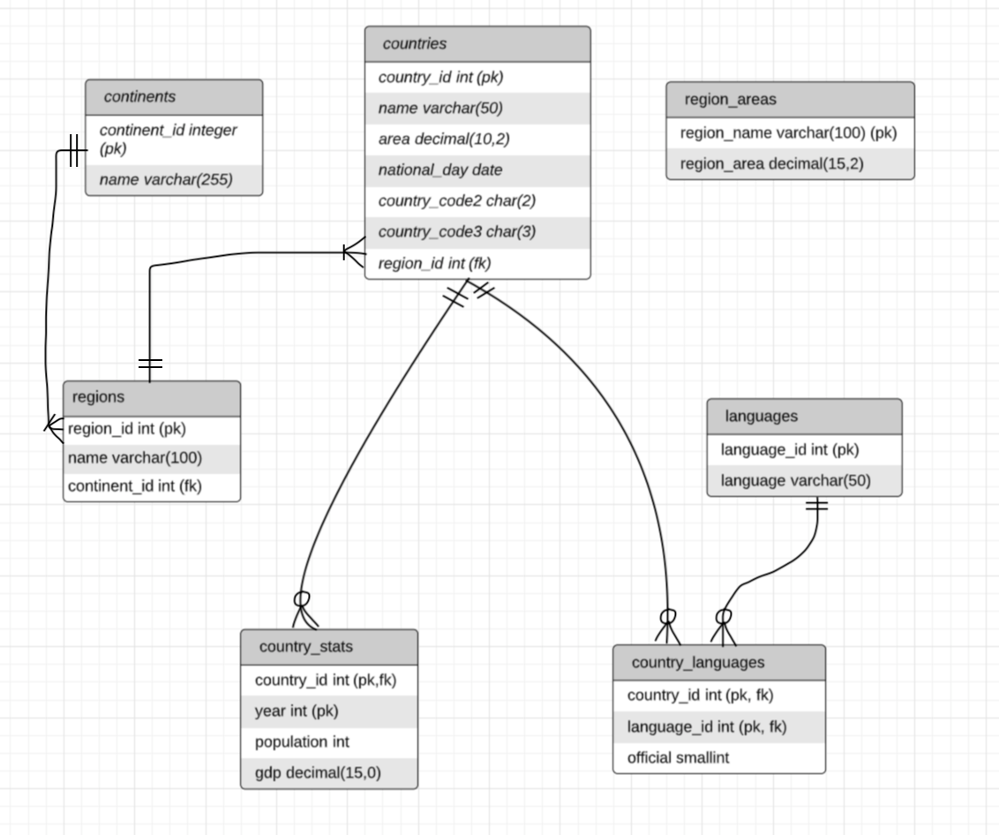
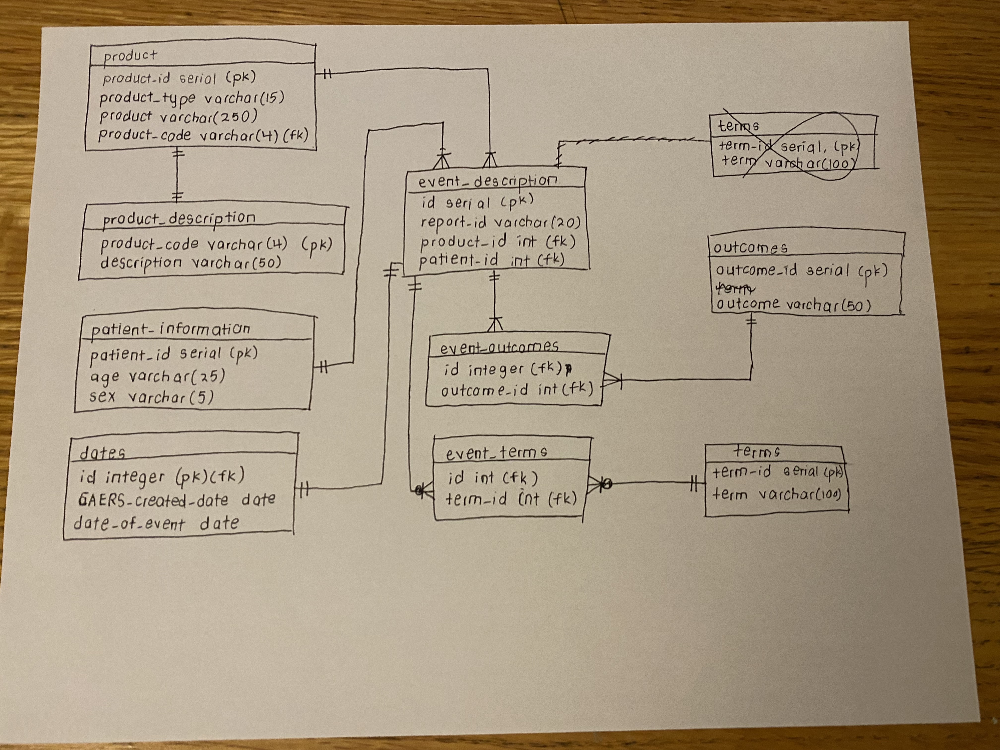

## Part 1: Create an ER Diagram by inspecting tables



-- Relationship between Tables and Explanation
1. One to One:

Explanation:

2. Many to Many:

a) Country and Languages
- A country can have multiple languages (minimum 0).
- Similarly, a language can be associated to multiple countries.
- They are connected through a join table, country_languages.
- I figured this relationship out because country_id and language_id are used as
- foreign and primary keys in the country_languages table.

3. One to Many:
a) Continent --> Regions
- A continent can have multiple regions.
- But a region can only have one continent. It cannot belong to multiple continents.
- This relationship is signified through continent_id being a foreign key in the regions table.

b) Region --> Country
- In one region, there can be multiple countries.
- However, a country can only belong to one region.
- This relationship is signified through region_id being a foreign key in the countries table.

c) Country --> Country_Stats
- One country can have multiple statistics for multiple years (e.g.).
- However, a set of statistics can only belong to one country.
- This relationship is signified through country_id being a foreign key in the country_stats table.

Region area is its own table. It does not have a direct relationship with other tables as
there are no foreign keys.

## Part 3: Examine a data set and create a normalized data model to store the data

```
### 1. This query tries to determine whether or not report id is unique

 report_id | frequency
-----------+-----------
 209126    |         2
 209563    |         2
 180072    |         3
 181790    |         4
 203668    |         2
(5 rows)

There are duplicates in the report_id columns, which means it is not suitable to use as the primary key of the staging
table.
```

```
--2. Checking if there are duplicate rows (showing only first 5 rows)
 report_id | caers_created_date | date_of_event | product_type |   product   | product_code |               description               | patient_age | age_units | sex |                                                    meddra_preferred_terms                                                    |                         outcomes                         | c
-----------+--------------------+---------------+--------------+-------------+--------------+-----------------------------------------+-------------+-----------+-----+------------------------------------------------------------------------------------------------------------------------------+----------------------------------------------------------+----
 209212    | 2017-03-22         | 2016-11-11    | SUSPECT      | EXEMPTION 4 | 53           |  Cosmetics                              |          70 | year(s)   | M   | PERITONEAL MESOTHELIOMA MALIGNANT                                                                                            | Patient Visited Healthcare Provider, Medically Important | 13
 192399    | 2015-12-30         |               | CONCOMITANT  | EXEMPTION 4 | 54           |  Vit/Min/Prot/Unconv Diet(Human/Animal) |          70 | year(s)   | F   | EYE IRRITATION, EYE PAIN, EYE INFLAMMATION, DISCOMFORT, EYE INFECTION, SJOGREN'S SYNDROME, VISION BLURRED, OCULAR HYPERAEMIA | Patient Visited Healthcare Provider, Medically Important | 10
 179495    | 2014-09-23         | 2014-08-21    | SUSPECT      | EXEMPTION 4 | 54           |  Vit/Min/Prot/Unconv Diet(Human/Animal) |          21 | year(s)   | F   | PALPITATIONS, CHEST PAIN, MALAISE, ANXIETY, LYMPHADENOPATHY                                                                  | Patient Visited Healthcare Provider, Patient Visited ER  | 10
 192430    | 2015-12-31         | 2015-07-24    | CONCOMITANT  | EXEMPTION 4 | 54           |  Vit/Min/Prot/Unconv Diet(Human/Animal) |          62 | year(s)   | F   | PAIN, LIP SWELLING, FOOD ALLERGY                                                                                             | Disability                                               |  8
 205562    | 2016-12-22         | 2016-10-17    | CONCOMITANT  | EXEMPTION 4 | 54           |  Vit/Min/Prot/Unconv Diet(Human/Animal) |          40 | year(s)   | F   | ALOPECIA, ANXIETY, CHEMICAL INJURY, PAIN, PARAESTHESIA, SCAR, WOUND                                                          | Patient Visited Healthcare Provider, Medically Important |  7
(5 rows)

There are duplicate rows. These must be removed and then only can we examine for suitable candidate keys.
```

```
## 3. Removing duplicate rows
CREATE VIEW
```

```
##4. checking potential canditate keys (first checking for report id and product)
    report_id    |                                                                                                 product                                                                                                  | c
-----------------+----------------------------------------------------------------------------------------------------------------------------------------------------------------------------------------------------------+---
 213904          | EXEMPTION 4                                                                                                                                                                                              | 3
 178211          | EXEMPTION 4                                                                                                                                                                                              | 3
 194882          | EXEMPTION 4                                                                                                                                                                                              | 3
 200371          | EXEMPTION 4                                                                                                                                                                                              | 3
 191731          | EXEMPTION 4                                                                                                                                                                                              | 3
 194590          | EXEMPTION 4                                                                                                                                                                                              | 2
 192430          | EXEMPTION 4                                                                                                                                                                                              | 2
 191503          | CENTRUM SILVER MEN'S 50+ (MULTIMINERALS, MULTIVITAMINS) TABLET

Even after removing the duplicate rows, there are columns with the same report_id and product. This means just the two
columns aren't sufficient candidate keys.
```

```
## 5. Adding a new columns in the composite key until no duplicates are there:

 report_id | product | product_type | product_code | c
-----------+---------+--------------+--------------+---
(0 rows)

So from this we know that these are the columns that form the candidate key are report_id, product, product_type, product_code.
This is because they can uniquely identify each event (evidence is rows matching in query is 0).
How I chose which keys to add?
Started by adding product_type (through inspection) as that was different between rows with the same report_id and product.
Still duplicates were found.
Then in rows with the same report_id, product and product_type, the product_code was the different, so added that to examine.
No duplicates were found.

```
```
##6. Checking functional dependency between product code and description.

product_code | count
--------------+-------
 34           |     1
 18           |     1
 2            |     1
 32           |     1
 37           |     1
 4            |     1
 9            |     1
 40O          |     1
 45           |     1
 13           |     1
(10 rows)

Since every product code only appears once, we can conclude that every product code identifies only one description.
Description is functionally dependent on product code.
````

```
##7. Checking functional dependency between product and product_code.
               product                | count
--------------------------------------+-------
 EXEMPTION 4                          |    33
 TURMERIC                             |     4
 COCONUT OIL                          |     3
 SYNC                                 |     3
 PREMIER PROTEIN                      |     3
 HERBAL TEA CONCENTRATE - CHAI FLAVOR |     3
 LOW CARB MILK CHOCOLATE              |     3
 SALAD                                |     3
 HOSTESS SUZY Q                       |     2
 RED DYE                              |     2

(47 rows)

Showing only first 10 rows.
No functional dependence between product and product_code as the same product,
can have multiple different values for description.
```

```
##8. Seeing Distinct set of Medra Preferred Terms Exploration
                       btrim
---------------------------------------------------
 ONYCHALGIA
 HYPOAESTHESIA
 EMBOLISM
 ARRHYTHMIA
 DRUG INTOLERANCE
 BLOOD PARATHYROID HORMONE INCREASED
 HAEMORRHOIDAL HAEMORRHAGE
 GRAM STAIN POSITIVE
 DIARRHOEA
 BLOOD POTASSIUM DECREASED
 EPIGASTRIC DISCOMFORT
 FUNCTIONAL GASTROINTESTINAL DISORDER
...
 (1783 rows)

There are 1783 distinct terms. This can go in a separate table for normalization.
```

```
##9. Seeing distinct set of Outcomes
              outcomes
-------------------------------------
 Other Outcome
 Death
 Patient Visited ER
 Patient Visited Healthcare Provider
 Hospitalization
 Life Threatening
 Congenital Anomaly
 Required Intervention
 Medically Important
 Disability
 Other Seriousness
(11 rows)

There are 11 distinct outcomes. This can go in a separate table for normalization.
```

Normalization:



- product: Created a separate table for product. This contained all info related to the product.
- product_description: Product_code and description are functionally dependent
hence a new table was created where product code is the primary key and description is
the attribute.
- patient_information: We have sex and age as infromation about the patients.
Since age and units point towards the same information they were combined into one column
for normalization. Patient id, a new primary key was created to identify each patient type.
- dates: Dates can be combined into their own column.
- terms: There are distinct set of terms (1738). To prevent atomicity, it was broken down into its own table.
- outcomes: There are distinct set of outcomes (11). To prevent atomicity, it was broken down into its own table.
- event_description: an event can be uniquely identified by the report_id, product, product_type and product_code.
Since the latter 3 columns were made into a new table in which product_id is the primary key. This table references
that key as a column. This table has its own id (surrogate primary key). I chose to have a surrogate primary key
because if I used a composite keys, there are too many columns involved, which makes it less clean during identification.
Additionally, if I kept it as composite keys, in the event_outcomes and event_terms tables, I would have to have all
multiple columns instead of just one column as the primary key (having one column is more straightforward).
- event_outcomes: An id's can have multiple outcomes, and an outcome can have multiple ids hence a join table was
created for the relationship.
- event_terms: For the same reason as event_outcomes, this join table was created.
